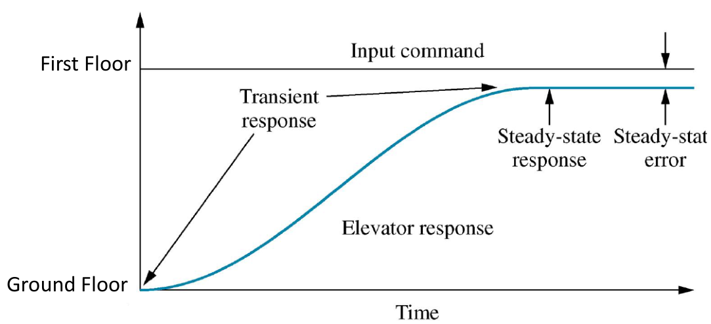

# Introduction

## So what is control? 

- Control is about achieving a desired and predictable system response to some input stimulus. 
- Not necessarily the fastest response!

--------------

## Elevator Control Example

-  How quickly would you like to get to the First floor?
 
    

- To control the elevator we need to have control over: 
  - The Transient Response Time

  - The steady-state error 
  
  - Any disturbances (How many passengers)
  
  - If the response time is too slow people get impatient, too fast and  people/equipment gets damaged
  
  - If there is some error the floor of the lift will not be in line with the exit floor, passenger might not feel safe. • How should the elevator respond when empty/full of passengers?

-----------------

## Control Strategies

### Open Loop Control

- No feedback loop. 

- Input has no knowledge of what is going on at the output. • Disturbances cannot be corrected.

    

- Open Loop Control Examples 

  - Domestic appliances: Toaster, microwave, washing machine, oven, vacuum cleaner 
  
  - Industrial applications: Irrigation systems, extractor fan, manual valve control 

  - **Advantages** 
    - Cheap to manufacture 
    - Good enough in many cases. 

  - **Disadvantages** 
    -  Accuracy 
    -  Repeatability
    -  Response time cannot be controlled 
    -  No disturbance rejection
  
### Closed Loop Control

- Feedback loop, input has knowledge of what is going on at the output 

- Disturbances can now be corrected.

    

- Closed Loop Control Examples 
  - Car cruise control, anti-lock braking system, domestic heating system, mobile phone  power modulation, altitude control etc 
  - Industrial applications: Temperature, pressure, flow, level, velocity, position etc
 
- **Advantages** 
   -  Very accurate 
   -  Repeatability of process 
   -  Response time and error can be controlled 
   -  Disturbance rejection 

- **Disadvantages** 
  - Cost 
  - If designed incorrectly can become unstable
  
