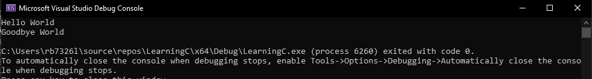
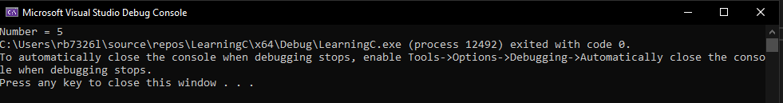
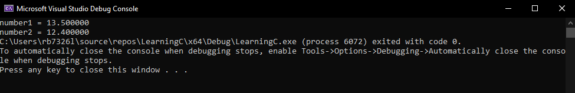
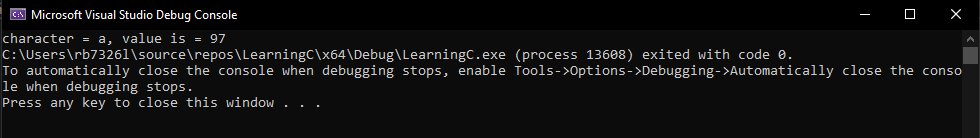
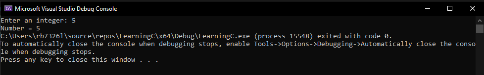
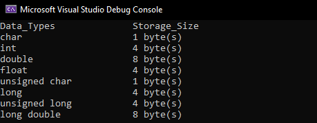

# Lab 1: Learning C

We will be doing this lab inconjuction with the C lecture. Key concepts will be explained and you will put into practice.

So let's make our first program.
## 1. Create a Project in Visual Studio:

- Open Visual Studio and create a new C project.
- Name the project `Learning_C`.
- Create a new source file named `helloworld.c`.

    ```c
    #include <stdio.h> // we need this library to get access to the input and out put methods for printing to terminal

    int main()
    {
        printf("Hello World\n"); // lets say hello, where it all began...
        
        printf("Goodbye World\n"); // this seems fitting as the program will close after this.
        
        return 0; // returns 0 to the int of main() and terminate the program
    }
    ```

    Some explanation about the above code:

    - All code gets executed inside of `main()`, 

    - For the program to terminate the `main()` has to have a returnable value, `int`, 

    - The keyword at the end of the `main()` is `return`, this is will return the value preceeding it, 

    - A `0` execute means no errors. 

    - Similar to `C#` to use libraries `c` programs import with the `#include` keyword instead of `using`. 

    - The included library is the standard input out header, `stdio.h`.  

    - By including this header file we have access to the `printf()` function that enables us to return information to the terminal in string format.

    Now we are going to compile the code so that we have an executable file that can be run from the terminal:

----

<details>
<summary><b>Click for Expected Output</b></summary>
<p></p>



Congratulations, you used the programming language of the gods!

</details>

----

## 2. Data Type: Printing Integer

- Now we are going to modifiy the script again `$ vim inputoutput.c` to look like below:

    ```c
    #include <stdio.h>
    int main()
    {
        int testInteger = 5;
        printf("Number = %d", testInteger);
        return 0;
    }
    ```

- Remeber to use the vim shortcuts from before to edit, write and quit.

- Run the script again... 

    

    - We use `%d` format specifier to print `int` types. Here, the `%d` inside the quotations will be replaced by the value of `testInteger`.


## 3. Data Types: Printing Float and Double

- Modify the same file again to look like below:

    ```c
    #include <stdio.h>
    int main()
    {
        float number1 = 13.5;
        double number2 = 12.4;

        printf("number1 = %f\n", number1);
        printf("number2 = %lf", number2);
        return 0;
    }
    ```


- Run it 

    

    - To print float, we use `%f` format specifier. Similarly, we use `%lf` to print double values.


## 4. Data Types: Printing Characters

- Modify the same file again to look like below:

    ```c
    #include <stdio.h>
    int main()
    {
        char chr = 'a';    
        printf("character = %c, value is = %d", chr, chr);  
        return 0;
    } 
    ```
- Run the program again and you should see the following ouput:

    

    - To print `char`, we use `%c` format specifier.
    - Every `char` has a numerial representation in ASCII, using `%d` we can get the numerical value.


## 5. User Input in C

In C programming, `scanf_s()` is one of the commonly used function to take input from the user. The `scanf_s()` function reads formatted input from the standard input such as keyboards.

- Again we will modify the program to look like the code below:

    ```c
    #include <stdio.h>
    int main()
    {
        int testInteger;
        printf("Enter an integer: ");
        scanf_s("%d", &testInteger);  
        printf("Number = %d",testInteger);
        return 0;
    }
    ```

- Run the program to get the following output, respond to the prompt and type in a number:
    

    - Here, we have used `%d` format specifier inside the `scanf_s()` function to take `int` input from the user. When the user enters an integer, it is stored in the `testInteger` variable.

    > Notice, that we have used `&testInteger` inside `scanf_s()`. It is because `&testInteger` gets the address of `testInteger`, and the value entered by the user is stored in that address. We will cover addressing and pointers at a later date.

---

## 6. Format Specifiers

Here is a table of possible format specifiers for input and output:

|Data Type|	Format Specifier|
|---|---|
|`int`	|`%d`|
|`char`	|`%c`|
|`float`	|`%f`|
|`double`	|`%lf`|
|`short int`	|`%hd`|
|`unsigned int`	|`%u`|
|`long int`	|`%li`|
|`long long int`	|`%lli`|
|`unsigned long int`	|`%lu`|
|`unsigned long long int`	|`%llu`|
|`signed char`	|`%c`|
|`unsigned char`	|`%c`|
|`long double`	|`%Lf`|

---


## 7. Data Types


- We are going to write a program that returns the size of each data type availabe in `c`, modify the program to look like below:

    ```c
    #include<stdio.h>
    int main(){

        printf("Data_Types\t\tStorage_Size \n");
        printf("char\t\t\t%d byte(s) \n", sizeof(char));
        printf("int\t\t\t%d byte(s) \n", sizeof(int));
        printf("double\t\t\t%d byte(s) \n", sizeof(double));
        printf("float\t\t\t%d byte(s) \n", sizeof(float));
        printf("unsigned char\t\t%ld byte(s) \n", sizeof(unsigned char));
        printf("long\t\t\t%d byte(s) \n", sizeof(long));
        printf("unsigned long\t\t%ld byte(s) \n", sizeof(unsigned long));
        printf("long double\t\t%ld byte(s) \n", sizeof(long double));

        return 0;
    }
    ```

- Run program to see the data types and there available sizes in bytes: 
    
