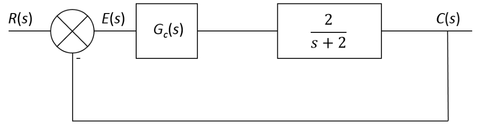
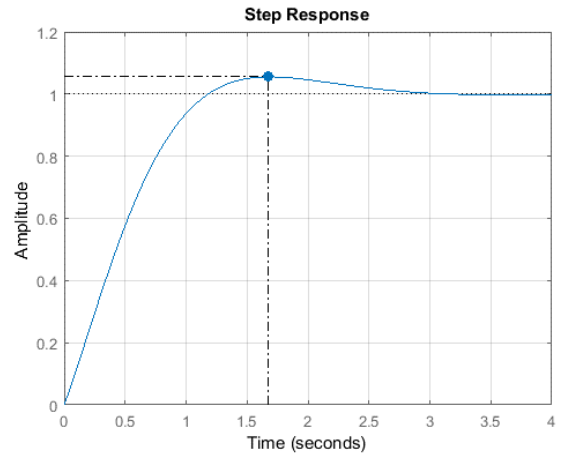
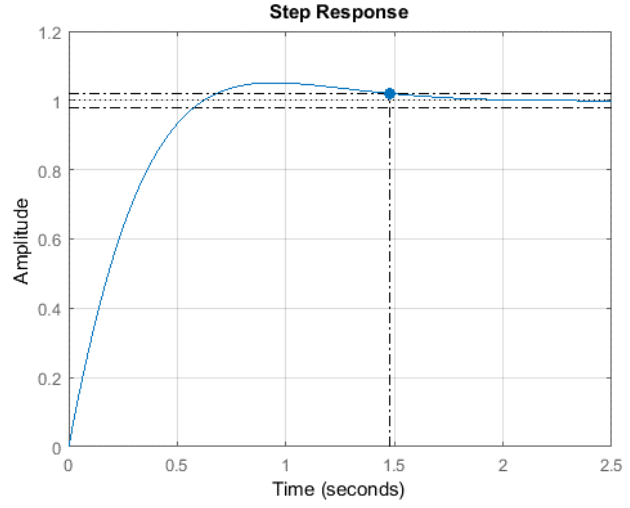
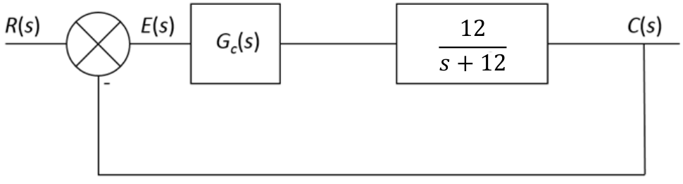

# Introduction

## PID Controllers

- **Gain Design** 
  - The Ziegler Nichols tuning method produces a very fast and often overly aggressive response, potentially damaging to actuators and amplifiers. 
  
  - As engineers, we want to be able to design the response of the system for a particular peak time or settling time for example. 
  
  - If we can design the response of the system then clearly we can design for a desired response which is the central goal of control engineering.

- **Example 1** 
  - Consider the following first order system where \\(G_c(s)\\) is the controller we need to design in order to achieve a desired response:

    

  - From control theory, we know that the peak time of a second order system is defined as:
        
    \\[T_p = \frac{\pi}{\omega_d}\\]
  
    Where...  \\[ \omega_d = \omega_n \sqrt{1 - \xi^2}\\] 
    
  - And the settling time can be defined as:

        
    \\[T_s = \frac{4}{\xi\omega_n}\\]     
        

   - The transfer function of a PI controller is defined as:

   \\[G_{PI}(s) = \frac{K_ps + k_i}{s}\\]

- The open loop transfer function of our system including the PI controller is: 

\\[G(s) = \frac{2k_ps + 2k_i}{s^2 +2s}\\]  

- The closed loop transfer function is therefore: 
  
\\[ T(s) = \frac{2k_ps + 2k_i}{s^2 + s(2+sk_p)+2k_i}\\]

----- 

- Comparing the denominator of the closed loop system to the standard form of a second order system we note that:

  \\[2+2k_p = 2\xi\omega_n\\]

-  And that:

\\[2k_i = \omega^2_n\\]

Let us design a system with a peak time of less than 2s and a damping factor of 0.7:

\\[T_p = \frac{\pi}{\omega_n\sqrt{1-\xi^2}}\ \Rightarrow 2 = \frac{\pi}{\omega_n\sqrt{1-0.7^2}} \\]

   - So \\(\omega_n\\) = 2.2 rads/s

<table style="border:hidden;">
<tr style="border:hidden;">
<td style="border:hidden;">

To determine \\(k_p\\):

   
      \[
         \begin{aligned}
               2 + 2k_p &= 2\xi\omega_n\\
               2k_p &= 2\xi\omega_n - 2\\
              2k_p &= 2 \cdot \xi\cdot \omega_n - 2 \\
              2k_p &= 2 \cdot 0.7 \cdot 2.2 - 2\\
              k_p &= 0.54
         \end{aligned}
      \]
   

</td>
<td>

To determine \\(k_i\\):

   
      \[
         \begin{aligned}
               2k_i &= \omega_n^2\\
               2k_i &= 4.84\\
              k_i &= 2.42
         \end{aligned}
      \]
   

</td>
</tr>
</table>

### System Response with Designed Gains:

- We can see that the peak time is less than 2s as required.

 

 ----------------------

## Example 2: 

- Let us design the system with a settling time of less than 1.5s and a damping factor of 0.8:

\\[T_s = \frac{4}{\xi\omega_n}\\]

- So \\(\omega_n\\) = 3.34 rads/s
  
<table style="border:hidden;">
<tr style="border:hidden;">
<td style="border:hidden;">

To determine \\(k_p\\):

   
      \[
         \begin{aligned}
               2 + 2k_p &= 2\xi\omega_n\\
               2k_p &= 2\xi\omega_n - 2\\
               2k_p &= 2 \cdot \xi\cdot \omega_n - 2 \\
               2k_p &= 2 \cdot 0.8 \cdot 1.25 - 2\\
               k_p &= 1.67
         \end{aligned}
      \]
   

</td>
<td>

To determine \\(k_i\\):

   
      \[
         \begin{aligned}
               2k_i &= \omega_n^2\\
               2k_i &= 11.16\\
       ]k_i &= 5.58
         \end{aligned}
      \]
   

</td>
</tr>
</table>

### System Response with Designed Gains:

- We can see that the peak time is less than 2s as required.

 
 
 ------

 ## Question 1:

For the following system design a PI controller that will result in a Peak Time of less than 0.5s and a damping factor of 0.75:

Answer...

 \\[K_p = 0.1\\] 
 \\[Ki = 7.52\\]

