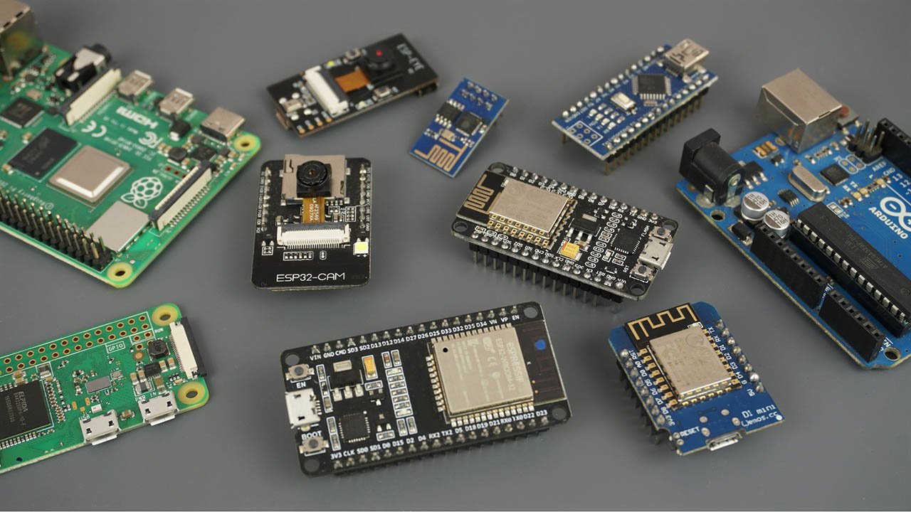

# Introduction

Here we will be looking at the theory and providing guidance on product design.

## 1. Specifying the Requirements
The design of electronic systems or devices usually starts with an approach from a customer asking if you make something that does ‘X’.  This statement is usually very broad and sometimes ill defined.  

As the Engineer, your role at this stage in the process is to help the customer fully understand what they want and to help them specify the goal completely, so there are no misunderstandings or misinterpretations as the project develops or when the product is delivered. 

Your objective is to reduce risk and exposure of all parties.  

The advantages of this are manifold; the customer is happy, the project runs smoother, there is no wasted effort and the whole process is quicker.  It is easier and cheaper to make changes in the product design, the earlier in the process they take place.

-----

## 2. Product Requirements Document
Once you have fully captured the requirements of the customer, a Product Requirements Document (PRD) can be produced and agreed upon.  This can be as simple as a single page, right up to a comprehensive document.  Which route depends on the size of the project.  Typical sections of the PRD include:-

- **Introduction** – Provides an overview of the product, its purpose, and objectives.

- **Scope** – Typically this would define the boundaries of the product, specifying what is included and what is not, outlining the features, functions, and components of the product.

- **Functional Requirements** - Describes the specific functionalities and tasks that the product should perform.  This section details the behaviour of the product under various scenarios and user interactions.

- **Non-Functional Requirements** – Specifies the quality attributes and performance characteristics of the product.  This includes requirements related to performance, reliability, security, usability, accessibility, and compliance with standards.

- **Product in use** – This would state detailed descriptions of where and how the product will be used.  This is key.  Sometimes statements such as ‘the device must work in minus twenty degrees centigrade’, although very clear and easy to understand and build to, do not tell the real or whole story.

- **Data Requirements** – In this section would be specified the capture rates, storage method, formats, volumes and transfer protocols.
 
- **Technical requirements** – This section outlines the hardware, software, and infrastructure requirements necessary for the development and deployment of the product. 

- **Constraints, Compromises and Assumptions** – Here are identified any limitations, constraints, dependencies, or assumptions that may impact the development or implementation of the product.  This includes budget constraints, time constraints, quality constraints, resource limitations, and technological dependencies.  Also, the priorities if there are conflicts.

- **User Interface Design** – What is required, and usually harder than you initially think.  Take for example something as simple as a push button.  How hard does it have to be pressed, for how long, does it need to be protected from accidental presses, does it need to be waterproof, glow, does the colour change when activated, how bright, what level of debounce, etc, etc.  With this one example it is easy to see how important and challenging it can be to get the specification correct.

- **Testing** – What testing is required to ensure the customer is happy with the completed product, or how the Engineer will know they have designed a successful product.

- **Timelines and Milestones** - Provides an overview of the project timeline, including key milestones, deliverables, and deadlines. It helps stakeholders understand the project schedule and track progress throughout the development process.  This would also include handover specifications.

### 2.2 Writing a PRD

A well-written PRD serves as a communication tool between all parties involved in the project, ensuring alignment and clarity throughout the product development lifecycle.

There are many more headings that can be used in the PRD, including specifying software methodology, processes to be followed, compliances and standards.  

Usually, large organisations will have a standard document and process for completing these.  If the organisation does not have one, the above will serve as a good base.

----

## 3. Project Management Triangle 

Within Engineering you have the Time, Quality and Cost triangle.  

You can have any two of the three design restrictions, but you can’t have all three.  The customer needs to understand this when they ask for the perfect device to be ready now, cheaply.

**Triangle showing the relationship between Time, costing and quality**

----

## 5. Electronic System Specific Design Criteria

As this course focuses on electronic system design, the key fundamentals the Engineer needs to know and understand, to enable them to produce a suitable product, are:-

- **Inputs** – What inputs will the device get.  Typical inputs can include, buttons, keypads, light, voltage, current, radio frequency energy.

- **Outputs** – Lights, screens/GUI, voltage, current, radio frequency energy.  These output signals can then be transformed into motion such as a solenoid actuating.

- **Weight** – Typically the lighter something is required to be, the higher the cost.  This is usually where the first compromise will have to be made.  Using exotic materials, devices can be made strong and light, however, there will be a cost in both financial and time dimensions.  Usually, these relationships are not linear.

- **Power consumption** – The lower the power consumption, the longer the battery life, or the smaller/cheaper the battery.  Another nonlinear compromise.  Ask the questions and see what the customer wants and is willing to compromise on.

- **Size** – Everyone wants as small a device as possible, until cost becomes an issue, then there will need to be a compromise.

- **Operating temperature and humidity ranges** – Battery power and electronic components don’t like operating at the extremes.  Some systems are better than others.

- **Storage temperature and humidity ranges** – As above and below.

- **Temperature and humidity cycles** – Cycles are the killer for electronic components.  As they heat and cool, any joints or connections are stressed, which can lead to failure. 

- **Vibration testing** – Understand any vibration (the frequencies, durations, amplitudes and repetitions) the device will encounter and test for that.  Or have the customer sign off they are happy with the design and the decision not to test.  

- **Electromagnetic emissions** – As well as designed emissions, such as input signals, electronic systems emit unintended radio frequency energy.  Good design can reduce this down to acceptable levels, so can housing design.

- **Electromagnetic susceptibility** – Electronic systems can malfunction due to external electromagnetic energy getting into the device.  Any hole in an otherwise sealed container, such as screens, switches and LEDs can lead to interference.  Good design, such as suitable cases and circuit design can stop any issues.

- **Start up time** – Some devices need to be used instantly, without time to wake up from a sleep mode or to boot up when turned on.  This will decide which ‘platform’ is most suitable.

---- 

## 6. Casing

The following considerations are more to do with the casing the devices will be mounted in.  However, an Electronic Engineer should always be cognisant of the issues:

- **Water tightness and corrosion** – Where will the device be used.

- **Drop and impact testing** – Solid state equipment is less susceptible to shocks and knocks.  That doesn’t mean that they are impervious.  Get a specification and testing regime.

- **Life of device** – Some devices will have a service use of up to 10 years storage and then one use.  Others might have a service life of three years, used all day every day.  By understanding what is expected of the device, design considerations can be made.

- **Spare parts availability** – Some devices might have a service life of 20 years.  Will spares be available to make replacement ones or to repair existing ones.

- **Quantity** – If the device is going to be a one off, or be made in very small batches, with long intervals between their drawdown at short notice, although unprofessional looking, an Arduino with the sensors mounted on Veroboard (the circuit boards with strips of copper and full of holes), inside a Commercial Off The Shelf (COTS) box might be sufficient.  That said, with Additive Layer Manufacturing (ALM), suitable bespoke enclosures are easy to produce.
,
----- 

## 7. Specification Sheets

All chipsets, platforms and technologies will come with a design specification sheet, or an information sheet.  These will explain the tolerances each component of system is tested to work under.  The supplier or the internet will have them.

-----

## 8. Designing the System

Between the Inputs and Outputs of a device, there is a ‘black box’ area.  This it the area the Electronic Engineer works in and creates a device that solves the customer’s issues.

As always with electronics and Engineering in general, there are many other questions that could be asked, depending on the sector and organisation you are working for.  Typically, a large organisation will have a check list or document to work off.

----

## 9. Prototyping and Platforms
It is very tempting to dive straight down into the design of the electronic system and get it working straight away.  Especially with a relatively simple system.  However, it is well established that projects take between two and three times the resources initially thought.  This is one of humanity’s traits, we are optimistic by nature.

There are many electronic system design methodologies available.  The one described below contains many stages and it may not be necessary for all projects.

## 9.2 Block Diagram – Architecture Design

- This stage is high-level architecture of the system, what are the main components, communication protocols and interfaces?

- This allows you to select appropriate technologies and platforms based on requirements and constraints and perform feasibility studies to evaluate different design options quickly and cheaply.

- Working from the PRD, sketch a simplified diagram of the electronic system to be designed.  A large square, with arrows on the left going in for inputs, and arrows on the right going out for the outputs.  Next to each arrow describe the signal.

- For the inputs it could be as simple as a digital button or an analogue signal between one and five volts, with a resolution of 128 steps, with the sampling rate of 1 millisecond.  

- Do the same with the output signals.

- Within the central box, use a flowchart to explain what happens to the input signals to produce the correct outputs.

- With this information stabilised, it is possible to move on to the next stage.

## 9.3 Breadboard/Prototype Board/Arduino/Raspberry Pi

With a little experience and a catalogue, it is possible to select the most suitable device to develop the prototype on.  In bygone times real breadboards were used as a base for prototyping.  Then plastic broads design for the purpose were developed.  These are ideal for mounting external components, such as sensors, passive, and analogue components quickly without soldering.   

Most electronic system design is now done on an Arduino or Raspberry Pi, even if some people refuse to admit it or look down on this method.  In these modern systems favour, they are quick, there is a lot of work done for you already, and they work.

There are many different Arduino and Raspberry Pi main boards and input and output boards that can be connected straight to the main boards.  Each board has its own strengths and weaknesses mainly around price, size, speed, and input and output ports.  

**A suite of Raspberry Pi (ARM) and Arduino development boards(ATMega)**

1. Select the main board that suits your requirements, starting with processing power, the type of input and outputs port.  Then memory available on the board.  Finally cost.

2. After constructing the hardware, upload the software you have concurrently developed and test the system against the design specification.

3. Work through the fault-finding methodologies of dividing the system into sections and testing each section is working, and you have cleared all the faults and the whole system is working as designed.  A simple few lines in this document, but a stage that may take a very long time.  Do not despair, with practice this stage becomes easier.  There maybe many iterations in this stage.

4. Test this system from an electronic operational point of view.

---- 

## 9.4 Preproduction Prototype, Schematic design and Printed Circuit Board (PCB) design

Now you have an electronic system that works correctly, it is time to specify its final form that also meets the physical characteristics of the specification.

1. If you have not already, create a schematic diagram of how the components are connected.  
   - Use Electronic Design Automation (EDA) software to do this.  There are many systems available.  
   
   - Different organisations have their preferred system.  If you do not get sufficient training on how to use the systems at your organisation, the forums and YouTube are your friend and usually the founts of all knowledge.  
   
   - Enter all the data you know of, and these systems will translate your schematic and requirements into an optimised **F**ield **P**rogrammable **G**ate **A**rray (**FPGA**) based, board design.

2. If there are any outstanding conflicts at this stage such as size, weight or cost, present them to the customer, with proposed solutions, for example reduced availability, performance, or expensive materials and the associated costs.  Then ask them what they want to do.

3. Have a board or a small batch of boards printed.  
   - It is common for organisations that do electronic system design to have these facilities on site.  

   - If not, there are many companies that provide this service.  
   
   - They will also assemble the boards for you if you wish for you to upload the software later.

4. Once you are happy the system performs, put it through the official testing process as specified in the PRD.

5. If the system passes, get the design signed off by the customer and produce as required.  
   - As with the initial stage of the design of the system, for manufacturing, even if you are doing it in-house, it is recommended to specify as much as possible.  
   
   - Typical specifications about the components used include the manufacturer of the components, method of soldering, type of solder, and testing. 